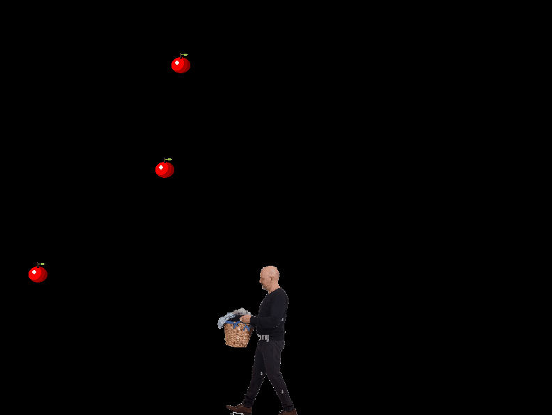

# Greg Engine
A game engine utilizing OpenGL written in C++. Currently features a component system very similar to Unity, 2d rendering, keyboard and mouse input and more.

## Setting up
Running `GenerateProjectfiles.bat` will generate relevant Visual Studio project files using Premake. As the engine currently only supports Windows there is no supported build system for Mac or Linux.

# Basket Man
Basket Man is a provided example project featuring the Basket Man, who collects apples falling from the sky. Use it as a reference to how to set up a basic level with a player character.

